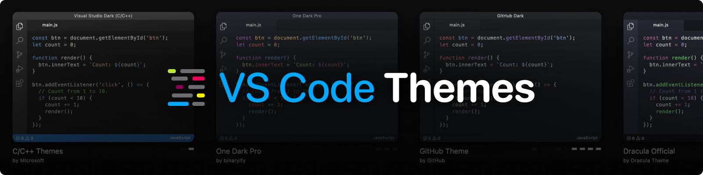

Search and preview themes from the [Visual Studio Marketplace](https://marketplace.visualstudio.com/search?target=VSCode&category=Themes&sortBy=Installs). Built with [Remix](https://remix.run/), [shadcn](https://ui.shadcn.com/) and hosted with [Railway](https://railway.app/).

Aanlytics powered by [Plausible CE](https://plausible.io/docs/self-hosting) and available at [vscodethemes.com/plausible](https://vscodethemes.com/plausible).

## How it Works

VS Code Themes scans the Visual Studio Marketplace and maintains a searchable database of themes.

In order for a theme to show up on the website:

1. A description must exist in the [extension's manifest](https://code.visualstudio.com/api/references/extension-manifest)
2. Themes must be `.json` (`.tmTheme` files are not supported)

Missing a theme? [Open an issue](https://github.com/vscodethemes/web/issues/new).

## Creating a Theme

Here are some helpful links if you'd like to create your own theme:

- [Color Themes, VS Code docs](https://code.visualstudio.com/docs/getstarted/themes)
- [Creating a VS Code Theme by Sarah Drasner, CSS-Tricks](https://css-tricks.com/creating-a-vs-code-theme/)

## History

Helping you discover new themes since 2018:

- **Version 1**: February 2018 ([Reddit](https://www.reddit.com/r/vscode/comments/7y79e4/preview_vscode_themes_before_installing_them/))
- **Version 2**: July 2018 ([Medium](https://hackernoon.com/announcing-vscodethemes-4544f50c2b5b))
- **Version 3**: April 2022 ([Github](https://github.com/vscodethemes/web/pull/228))
- **Version 4**: October 2024 ([Github](https://github.com/vscodethemes/web/pull/284))
